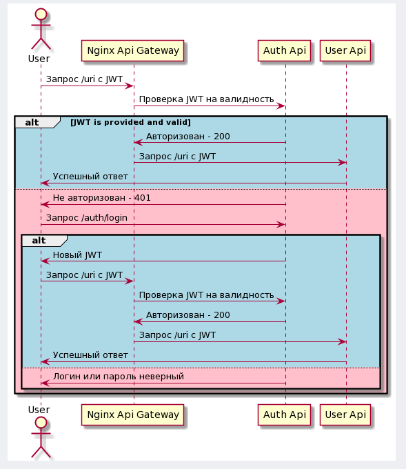

# Otus.Project
📚 Homework(s) in scope of a course ["Microservice Architecture"](https://otus.ru/lessons/microservice-architecture/)

---

Prerequisites:
```console
# if a bitnami repo is not added yet, uncomment the line below and run in a console
#helm repo add bitnami https://charts.bitnami.com/bitnami
# if a prometheus-community repo is not added yet, uncomment the line below and run in a console
#helm repo add prometheus-community https://prometheus-community.github.io/helm-charts
# if a ingress-nginx repo is not added yet, uncomment the line below and run in a console
#helm repo add ingress-nginx https://kubernetes.github.io/ingress-nginx
# update newly added helm repos
#helm repo update

# if you don't have newman installed, uncomment the line below and run in a console
#npm install -g newman
```

---

How to run hw #1:
```console
# https://kubernetes.github.io/ingress-nginx/deploy/#quick-start
# if you don't have ingress-nginx installed, uncomment the line below and run in a console
#kubectl apply -f https://raw.githubusercontent.com/kubernetes/ingress-nginx/controller-v1.0.5/deploy/static/provider/cloud/deploy.yaml

# install an application with '/health' endpoint
kubectl apply -f k8s-manifests/hw-1/main-api.yaml
```

How to test hw #1:
```console
curl http://arch.homework/health # returns "Healthy"
curl http://arch.homework/home/hello # returns "hello"
curl http://arch.homework/otusapp/{student_name}/home/hello # will be forwarded to http://arch.homework/home/hello

# remove all the resources
kubectl delete -f k8s-manifests/hw-1/main-api.yaml

# delete ingress-nginx after testing is done, uncomment the line below and run in a console
#kubectl delete -f https://raw.githubusercontent.com/kubernetes/ingress-nginx/controller-v1.0.5/deploy/static/provider/cloud/deploy.yaml
```

---

How to run hw #2:
```console
# https://kubernetes.github.io/ingress-nginx/deploy/#quick-start
# if you don't have ingress-nginx installed, uncomment the line below and run in a console
#kubectl apply -f https://raw.githubusercontent.com/kubernetes/ingress-nginx/controller-v1.0.5/deploy/static/provider/cloud/deploy.yaml

cd k8s-manifests/hw-2/
# install postgres instance with metrics exporter
helm install db bitnami/postgresql -f postgres-chart/values.yaml --namespace otus-project --create-namespace --atomic
# install an application with crud api for managing users
helm install crud-api crud-api-chart/ --namespace otus-project --atomic
```

How to test hw #2:
```console
curl http://arch.homework/liveness # returns "Healthy"
curl http://arch.homework/readiness # returns "Healthy"
curl http://arch.homework/users # returns list of 3 users

# alternative approach for testing
newman run postman_collection.json

# remove all the resources
kubectl delete namespace otus-project

# delete ingress-nginx after testing is done, uncomment the line below and run in a console
#kubectl delete -f https://raw.githubusercontent.com/kubernetes/ingress-nginx/controller-v1.0.5/deploy/static/provider/cloud/deploy.yaml
```

---

How to run hw #3:
```console
cd k8s-manifests/hw-3/
# install prometheus stack
helm install prometheus prometheus-community/kube-prometheus-stack -f prometheus-chart/values.yaml --namespace otus-project --create-namespace --atomic
# install ingress-nginx with enabled service monitor
helm install nginx ingress-nginx/ingress-nginx -f ingress-nginx-chart/values.yaml --namespace otus-project --atomic

# import the following dashboard to grafana via configmap
# k8s-manifests/hw-3/prometheus-chart/grafana_dashboard.json
kubectl apply -f prometheus-chart/grafana_configmap.yaml --namespace otus-project

cd ../hw-2/
# install postgres instance with metrics exporter
helm install db bitnami/postgresql -f postgres-chart/values.yaml --namespace otus-project --atomic
# install an application with crud api for managing users
helm install crud-api crud-api-chart/ --namespace otus-project --atomic

# run prometheus on localhost:9090
kubectl port-forward service/prometheus-kube-prometheus-prometheus -n otus-project 9090
# run grafana on localhost:9000 (admin:prom-operator)
kubectl port-forward service/prometheus-grafana -n otus-project 9000:80
```

How to test hw #3:
```console
# run a simple load test
ab -n 5000 -c 5 http://arch.homework/users

# remove all the resources
kubectl delete namespace otus-project
kubectl delete crd alertmanagerconfigs.monitoring.coreos.com
kubectl delete crd alertmanagers.monitoring.coreos.com
kubectl delete crd podmonitors.monitoring.coreos.com
kubectl delete crd probes.monitoring.coreos.com
kubectl delete crd prometheuses.monitoring.coreos.com
kubectl delete crd prometheusrules.monitoring.coreos.com
kubectl delete crd servicemonitors.monitoring.coreos.com
kubectl delete crd thanosrulers.monitoring.coreos.com
```

---

How to run hw #4:
```console
cd k8s-manifests/hw-4/
# install istio
istioctl install --set profile=demo -y
# install prometheus
kubectl apply -f https://raw.githubusercontent.com/istio/istio/release-1.12/samples/addons/prometheus.yaml
# install kiali
kubectl apply -f https://raw.githubusercontent.com/istio/istio/release-1.12/samples/addons/kiali.yaml
# enable istio sidecar injection for default ns
kubectl label namespace default istio-injection=enabled
# install test-api
kubectl apply -f test-api/two_versions_of_api.yaml
# install istio-gateway
kubectl apply -f istio-gateway/manifest.yaml
# run kiali dashboard
istioctl dashboard kiali
```

How to test hw #4:
```console
# run a simple load test
ab -n 500 -c 2 localhost/health

# remove all the resources
kubectl delete -f test-api/two_versions_of_api.yaml
kubectl delete -f istio-gateway/manifest.yaml
kubectl delete -f https://raw.githubusercontent.com/istio/istio/release-1.12/samples/addons/prometheus.yaml
kubectl delete -f https://raw.githubusercontent.com/istio/istio/release-1.12/samples/addons/kiali.yaml
istioctl x uninstall --purge
kubectl delete namespace istio-system
```

---

hw #5 schema:



How to run hw #5:
```console
# https://kubernetes.github.io/ingress-nginx/deploy/#quick-start
# if you don't have ingress-nginx installed, uncomment the line below and run in a console
#kubectl apply -f https://raw.githubusercontent.com/kubernetes/ingress-nginx/controller-v1.0.5/deploy/static/provider/cloud/deploy.yaml

cd k8s-manifests/hw-5/
# install postgres instance
helm install db bitnami/postgresql -f postgres-chart/values.yaml --namespace otus-project --create-namespace --atomic
# install an application with crud api for managing users
helm install crud-api crud-api-chart/ --namespace otus-project --atomic
# install auth api
helm install auth-api auth-api-chart/ --namespace otus-project --atomic
```

How to test hw #5:
```console
newman run postman_collection.json

# remove all the resources
kubectl delete namespace otus-project

# delete ingress-nginx after testing is done, uncomment the line below and run in a console
#kubectl delete -f https://raw.githubusercontent.com/kubernetes/ingress-nginx/controller-v1.0.5/deploy/static/provider/cloud/deploy.yaml
```