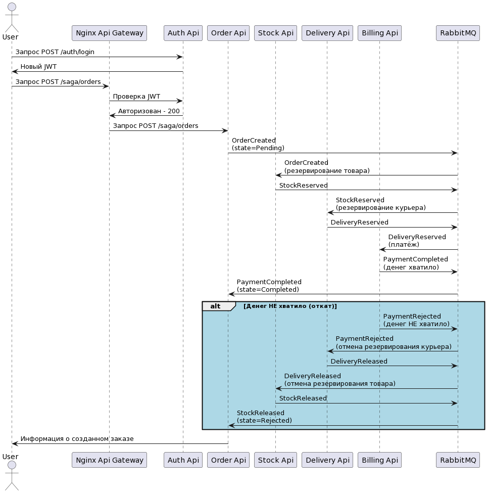

# Otus.Project
📚 Homework #9

---

Prerequisites:
```console
# if a bitnami repo is not added yet, uncomment the line below and run in a console
#helm repo add bitnami https://charts.bitnami.com/bitnami
# update newly added helm repos
#helm repo update

# if you don't have newman installed, uncomment the line below and run in a console
#npm install -g newman
```

---

hw #9 schema:


How to run hw #9:
```console
# https://kubernetes.github.io/ingress-nginx/deploy/#quick-start
# if you don't have ingress-nginx installed, uncomment the line below and run in a console
#kubectl apply -f https://raw.githubusercontent.com/kubernetes/ingress-nginx/controller-v1.0.5/deploy/static/provider/cloud/deploy.yaml

# use helm charts from hw-6
cd ../hw-6
# install postgres instance
helm install db bitnami/postgresql -f postgres-chart/values.yaml --namespace otus-project --create-namespace --atomic
# install rabbitmq instance
helm install sbus bitnami/rabbitmq -f rabbitmq-chart/values.yaml --namespace otus-project --atomic
# install an application with crud api for managing users
helm install crud-api crud-api-chart/ --namespace otus-project --atomic
# install auth api
helm install auth-api auth-api-chart/ --namespace otus-project --atomic
# install order api
helm install order-api order-api-chart/ --namespace otus-project --atomic
# install stock api
helm install stock-api stock-api-chart/ --namespace otus-project --atomic
# install delivery api
helm install delivery-api delivery-api-chart/ --namespace otus-project --atomic
# install billing api
helm install billing-api billing-api-chart/ --namespace otus-project --atomic
```

How to test hw #9:
```console
cd ../hw-9
newman run postman_collection.json

# remove all the resources
kubectl delete namespace otus-project

# delete ingress-nginx after testing is done, uncomment the line below and run in a console
#kubectl delete -f https://raw.githubusercontent.com/kubernetes/ingress-nginx/controller-v1.0.5/deploy/static/provider/cloud/deploy.yaml
```
